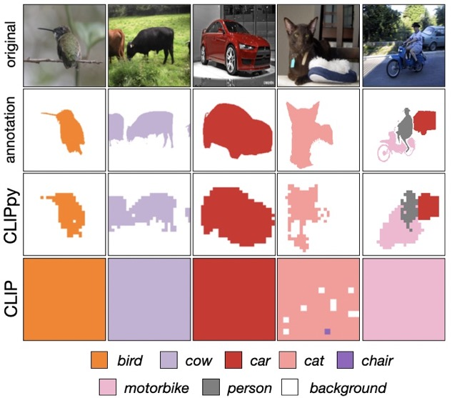

# CLIPpy

	
[](https://paperswithcode.com/sota/unsupervised-semantic-segmentation-with-4?p=perceptual-grouping-in-vision-language-models)	
[](https://paperswithcode.com/sota/unsupervised-semantic-segmentation-with-5?p=perceptual-grouping-in-vision-language-models)
[](https://paperswithcode.com/sota/unsupervised-semantic-segmentation-with-6?p=perceptual-grouping-in-vision-language-models)
[](https://paperswithcode.com/sota/unsupervised-semantic-segmentation-on-pascal-1?p=perceptual-grouping-in-vision-language-models)
[](https://paperswithcode.com/sota/unsupervised-semantic-segmentation-with-3?p=perceptual-grouping-in-vision-language-models)


**Implementation of [Perceptual Grouping in Contrastive Vision-Language Models](https://arxiv.org/abs/2210.09996)** paper.


[Paper Link](https://arxiv.org/abs/2210.09996) | [Gradio Demo](https://huggingface.co/spaces/kahnchana/clippy) |  [Colab Notebook](https://colab.research.google.com/drive/1iObo3WQHqHpEwUGmyHHQpRrOUqHoOZPF?usp=sharing)


> **Abstract:**
>*Recent advances in zero-shot image recognition suggest that vision-language models learn generic visual representations with a high degree of semantic information that may be arbitrarily probed with natural language phrases. Understanding an image, however, is not just about understanding what content resides within an image, but importantly, where that content resides. In this work we examine how well vision-language models are able to understand where objects reside within an image and group together visually related parts of the imagery. We demonstrate how contemporary vision and language representation learning models based on contrastive losses and large web-based data capture limited object localization information. We propose a minimal set of modifications that results in models that uniquely learn both semantic and spatial information. We measure this performance in terms of zero-shot image recognition, unsupervised bottom-up and top-down semantic segmentations, as well as robustness analyses. We find that the resulting model achieves state-of-the-art results in terms of unsupervised segmentation, and demonstrate that the learned representations are uniquely robust to spurious correlations in datasets designed to probe the causal behavior of vision models.*

<p align="center">
  
</p>

## Setup
Refer to `requirements.txt`.


## Pre-trained Model
We replicate the work in CLIPpy paper under scaled down settings (due to resource and compute limitations). We use the CC-12M dataset (some files missing due to download issues) and use a single node with 8 V100 GPUs for training. Training for 5000 iterations, we are able to reach close to the reported segmentation performance on PASCAL VOC dataset. 
Our pre-trained checkpoint is provided [here](https://github.com/kahnchana/clippy/releases/download/v1.0/clippy_5k.pt).  

## Inference
We present examples of using CLIPpy in the following notebooks:
* [Basic inference](https://github.com/kahnchana/clippy/blob/master/notebooks/clippy.ipynb)
* [ImageNet & PASCAL VOC evaluation](https://github.com/kahnchana/clippy/blob/master/notebooks/evaluate.ipynb)
* WaterBirds evaluation (TBA)

## Results

|        | ImageNet (acc) | VOC (mIoU) | VOC (JI) |
|--------|----------------|------------|----------|
| CLIPpy | 45.3           | 50.8       | 47.5     |

## Analysis
We provide some analysis on the feature space of CLIPpy. 
* bird to different backgrounds vs average background (TBA)
* feature space visualization (TBA) 


## Training
We build over the [OpenCLIP](https://github.com/mlfoundations/open_clip) repository, use pre-trained checkpoint weights from [DINO](https://github.com/facebookresearch/dino) and [Sentence-T5](https://huggingface.co/sentence-transformers/sentence-t5-base), and follow the training schedule from the [CLIPpy paper](https://arxiv.org/abs/2210.09996). We also directly utilize the patch dropout implementation in OpenCLIP.

We run the train job as follows:
```bash
torchrun --nproc_per_node 8 -m training.main \
    --train-data "${ROOT}/data/cc12m/{00000..01242}.tar" \
    --train-num-samples 10968539 \
    --dataset-type webdataset \
    --batch-size 1024 \
    --precision fp32 \
    --grad-checkpointing \
    --workers 8 \
    --imagenet-val "${ROOT}/data/imagenet/val/" \
    --model "clippy-B-16" \
    --report-to "wandb" \
    --wandb-project-name "clip" \
    --zeroshot-frequency 1 \
    --name "clippy001"

```

## Citation

```
@article{clippy2022,
  title={Perceptual Grouping in Contrastive Vision-Language Models},
  author={Kanchana Ranasinghe and Brandon McKinzie and Sachin Ravi and Yinfei Yang and Alexander Toshev and Jonathon Shlens},
  journal={ArXiv},
  year={2022},
  volume={abs/2210.09996}
}
```
